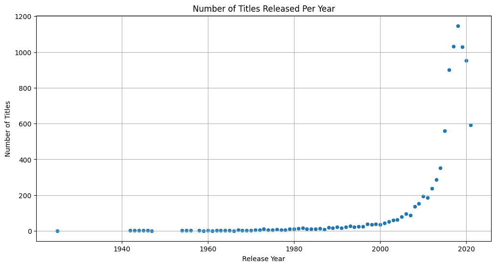
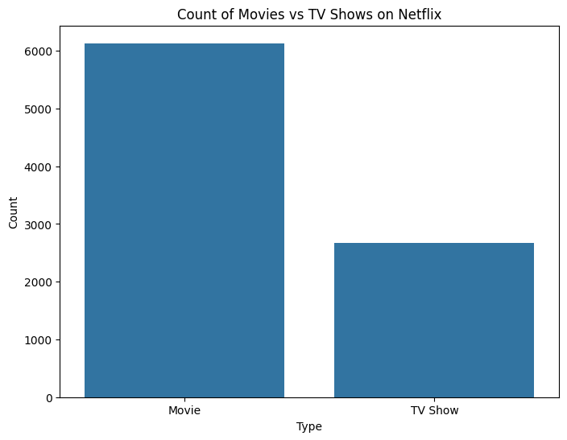
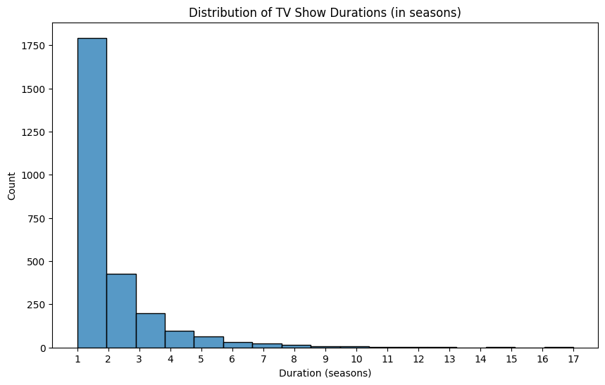
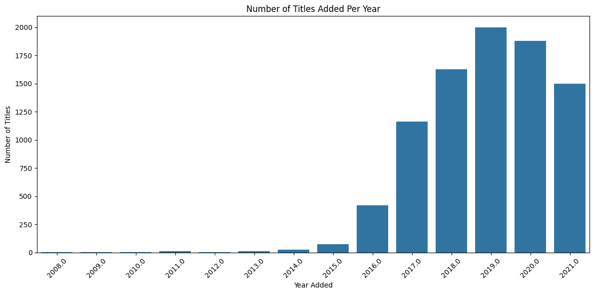

# 📊 Python Data Analysis – Netflix Dataset

## 📌 Overview
This project analyzes the Netflix dataset to explore insights such as:
- Content distribution by release year.
- Genre-wise analysis.
- Country-based production trends.
- Duration patterns for movies and TV shows.

It uses **Python** with **Pandas**, **Matplotlib**, and **Seaborn** to perform data exploration and visualization.

---

## 🚀 Usage
1. Open the `task2.ipynb` notebook in Jupyter Notebook or JupyterLab.
2. Run the cells sequentially to:
   - Load and clean the Netflix dataset.
   - Perform data analysis.
   - Generate visualizations for insights.

---

## 📊 Results
Below are some output images generated from the analysis:

### 🎬 Count of movies vs TV shows on Netflix

### 🌍 Number of titles released per year

### 🎬 Distribution of TV shows duration

### 🌍 Number of titles added per year

---

💡 *Feel free to fork this repo and try your own analysis with the Netflix dataset!*
